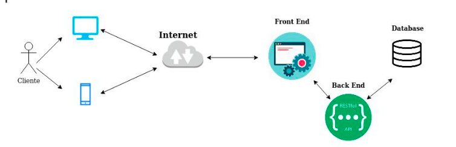

Observe o desenho abaixo, ele é um desenho simples de um sistema web que recebe requisições da internet via navegador Desktop e Mobile. Imagine que o cliente te mostrou essa arquitetura que se encontra em servidores locais na empresa. O cliente reclamou que os servidores não estão atendendo a volumetria de requisições e que o sistema foi invadido 5 vezes no último mês. Descreva como você recriaria essa arquitetura, levando em consideração:

- Volumetria variável de requisições, de manhã em torno de 100.000 por hora, horário comercial entre 200.000 até 600.000 por hora e a noite retorna para os 100.000 por hora
- Recursos que você usaria, se for cloud, descreva quais serviços você usaria e porque
- Segurança de sua infraestrutura.
- Monitoramento dos servidores e da aplicação.
- A aplicação web é uma loja virtual (dependendo da campanha de marketing as requisições ao sistema dobram ou triplicam perante a primeira sentença.

